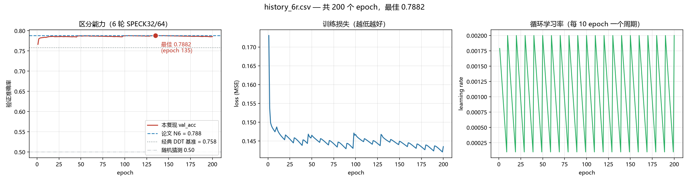
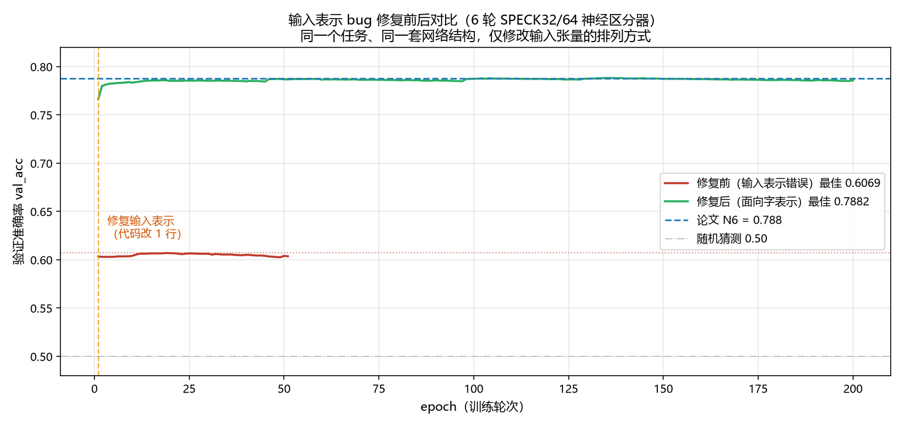

# Gohr Neural Distinguisher — PyTorch 复现

用 **PyTorch 从零复现** [Gohr, "Improving Attacks on Round-Reduced Speck32/64 using Deep Learning", CRYPTO 2019] 中的 **神经区分器（Neural Distinguisher）**。

本项目在理解 Gohr 论文及其官方实现（[agohr/deep_speck](https://github.com/agohr/deep_speck)，numpy/Keras 版）的基础上，用 PyTorch 重写为 **GPU 向量化**版本，支持批量生成训练数据、快速训练、断点续训与实时监控。

> ⚠️ 声明：本仓库是对 Gohr 论文方法的**独立复现**，不含原作者的 deep_speck 代码。原版（numpy/Keras）见上方链接。

---

## 背景

**神经区分器**是一个二分类神经网络：输入"一对密文"，判断它是真实加密产生的（标签 1，含差分结构）还是完全随机的（标签 0）。能区分 → 说明降轮 SPECK 留下了神经网络能抓住的统计偏差 → 该偏差可进一步用于**密钥恢复攻击**。

### SPECK32/64
- ARX 结构（Add-Rotate-XOR）轻量级分组密码，明文 32 bit + 密钥 64 bit，完整 22 轮
- 降轮后（5/6/7/8 轮）安全性变弱，可被神经网络区分器区分

---

## 核心结果（论文基准 vs 本复现）

论文基准取自 Gohr 2019 **表 2**（D = 经典差分分布表方法，N = 神经网络方法）。

| 轮数 | 经典 DDT 基准 (D) | 论文神经目标 (N) | 本复现 |
|------|------------------|-----------------|--------|
| 1 轮 | ~1.0 | ~1.0 | **1.0000** |
| 2 轮 | ~1.0 | ~1.0 | **0.9995** |
| 3 轮 | — | — | **0.9745** |
| 5 轮 | 0.911 | 0.929 | 待重测 |
| **6 轮** | 0.758 | **0.788** | **0.7882** ✅（200 epoch 完整训练） |
| 7 轮 | 0.591 | 0.616 | 待测 |
| 8 轮 | 0.512 | 0.514 | 待测 |

**6 轮结果（200 epoch）：最佳验证准确率 0.788199，对照论文 0.788，差距 +0.0002。**



*上图：6 轮 SPECK32/64 区分器的完整训练曲线（200 epoch）。左图为验证准确率（红线），蓝色虚线是论文的目标值 0.788，灰点线是经典差分分布表方法的基准 0.758；中图为训练损失；右图为循环学习率（每 10 epoch 一个周期）。*

---

## 🔍 一个值得记录的调试案例：输入表示 bug

早期版本在 5/6 轮上性能远低于论文（5 轮 0.80、6 轮停滞在 0.60），当时误判为"训练资源不足"。**真实原因是输入表示的实现与论文语义不一致。**

**问题**：论文要求把 64 个比特组织成 **4 个 16 位字**（面向字结构，`Reshape((4,16))`），而原实现写成了按"每 4 比特一组"切分：

```python
# ❌ 错误：通道 j 拿到的是 bit[j], bit[4+j], bit[8+j]...（比特错位）
x = x.view(N, 16, 4).permute(0, 2, 1)

# ✅ 正确：通道 j 拿到的是 bit[16j .. 16j+15]（完整的第 j 个 16 位字）
x = x.view(N, 4, 16)
```

**后果**：破坏了模加法"进位只在相邻比特间传播"的局部性，网络看到的是一堆错位比特。

**效果**（同一个 6 轮任务、同一套网络结构，仅修改输入张量的排列方式）：

| | 修复前 | 修复后 |
|---|---|---|
| 最佳 val_acc | 0.6069（跑了 51 个 epoch） | **0.7882**（跑满 200 个 epoch） |
| 与论文差距 | −0.1811 | **+0.0002** |



*上图：红色为修复前的训练曲线（停在 0.6069），绿色为修复后（达到 0.7882），蓝色虚线是论文的 N6 目标 0.788。*

**诊断经验**（已写入 `docs/复现学习记录.md`）：
> "低轮数正常、高轮数不达标"是极强的诊断信号——说明**信息还在，但结构被破坏**，而非资源不足。
> 加密实现正确 ≠ 数据管线正确；张量形状对 ≠ 语义布局对。

---

## 环境要求

- Python 3.11+
- PyTorch 2.x（CUDA 版）
- NVIDIA GPU（8 GB 显存可跑 5/6/7 轮）

```bash
conda create -n speck python=3.11
conda activate speck
pip install torch --index-url https://download.pytorch.org/whl/cu121
```

---

## 快速开始

```bash
# 1. 验证 SPECK 加密实现（官方测试向量）
python -c "from src.speck.speck import check_testvector; check_testvector()"

# 2. 快速测试（3 轮，约 2 分钟）
python train.py --rounds 3 --train-size 100000 --eval-size 20000 --epochs 3 --depth 3

# 3. 论文级 6 轮训练（10^7 样本 + 200 epoch + depth 10，约 19 小时）
python train.py --rounds 6 --train-size 10000000 --eval-size 1000000 --epochs 200 --depth 10

# 4. 断点续训（中断后恢复，不会重跑）
python train.py --rounds 6 --train-size 10000000 --epochs 200 --depth 10 --resume

# 5. 神经密钥恢复攻击（用 6 轮区分器攻击 8 轮，64 对明文，约 7 秒）
python key_recovery.py
python key_recovery.py --trials 20    # 跑 20 次看统计
```

### 训练监控

每次训练自动生成两类记录：

| 产出 | 位置 | 用途 |
|---|---|---|
| CSV | `checkpoints/history_{N}r.csv` | Excel 可直接打开 |
| TensorBoard | `checkpoints/tb_{N}r/` | 网页实时曲线（`python -m tensorboard.main --logdir checkpoints`） |
| 曲线图 | `training_curves.png`（`python plot_log.py`） | 三张图并排 + 论文基准线 |
| 权重 | `checkpoints/net{N}r.pt`（最佳）/ `last_{N}r.pt`（最新） | 续训用 last，评估用 best |

---

## 项目结构

```
gohr_pytorch_reproduce/
├── src/
│   ├── speck/speck.py            # SPECK32/64 加密 + 密钥编排（标量+批量向量化）
│   ├── data/dataset.py           # GPU 向量化训练数据生成
│   └── model/distinguisher.py    # BitSliced ResNet 网络（含详细注释）
├── train.py                      # 训练主入口（CLI 参数化 + 续训 + 日志）
├── plot_log.py                   # 日志 → 曲线图
├── docs/复现学习记录.md           # 复现笔记（含输入表示 bug 的完整分析）
├── 怎么自己开始训练.md            # 操作手册
├── VSCode使用说明.md             # VSCode 运行配置
├── 开始训练.py / .bat            # 交互式训练启动器
└── requirements.txt
```

---

## 神经密钥恢复攻击

训练好的区分器可以直接升级为**密钥恢复攻击**（Gohr 论文第 4.4 节），代码见 [`key_recovery.py`](key_recovery.py)，详细说明见 [`docs/密钥恢复攻击说明.md`](docs/密钥恢复攻击说明.md)。

**攻击构造**（以 8 轮为例）：

```
        8 轮加密
├──────────────────────────┤
 ①前置1轮  ②中间6轮  ③剥离1轮
 （免费）  （区分器） （试钥枚举 2^16）
```

两端各绕过一轮，所以 **6 轮区分器可以攻击 8 轮**：
- **前置一轮是免费的** —— SPECK 第一轮的前两步（旋转、模加）不用密钥，攻击者可自行控制第一轮输出差分
- **剥离一轮靠试钥** —— 猜对密钥就等于正确倒推一轮，剥完得到的正好是"差分对经过 6 轮"的状态，与区分器训练分布完全一致

**实测结果**（64 对选择明文，每次约 7 秒，各跑 20 次独立试验）：

| 攻击轮数 | 区分器 | 平均密钥排名 | 中位排名 | 成功率 | 与论文对照 |
|---|---|---|---|---|---|
| 8 轮 | 6 轮（0.7882） | 0.5 | 0 | 70% | 论文无 8 轮数据 |
| **9 轮** | 7 轮（0.6101） | **41.8** | **2** | **30%** | **论文 N7：52.1 / 1.0 / 35.8%** ✅ |

**9 轮攻击与论文表 3 数字级别对齐 → 攻击复现成功。**

> 一个值得注意的现象：20 次试验中有 3 次排名很差（得分仅个位数，正常为 15-36）。这对应论文报告的**密钥依赖性**——某些密钥下区分器真阳性率会从 57.1% 降到 49.7%（接近随机），导致攻击失败。这也是论文成功率只有 35.8% 的原因：它本质是概率性攻击。

**一个印证论文命题的观察**：攻击中出现的高分错误候选，往往是真密钥**翻转最高位**的结果——这正是论文命题 1 所说的"纯差分区分器无法区分的一组密钥"。而神经区分器成功把它们区分开了（183 vs 174 分），实证了它确实利用了差分之外的信息。

## 方法要点

### SPECK 轮函数（对照论文式 2）
```python
c0 = ror(c0, 7)            # (L ≫ α)，α=7
c0 = (c0 + c1) & 0xFFFF    # ⊞ R，模 2^16 加法
c0 = c0 ^ k                # ⊕ K，注入子密钥
c1 = rol(c1, 2)            # (R ≪ β)，β=2
c1 = c1 ^ c0
```

### 密钥编排（Gohr 的"自滚动"设计）
不单独设计复杂编排，而是**把轮数 `i` 当子密钥**，用轮函数自己滚动生成：
```python
ks[0] = k[3]
l = [k[2], k[1], k[0]]
for i in range(rounds-1):
    l[i%3], ks[i+1] = enc_one_round(l[i%3], ks[i], i)
```

### 训练数据生成（GPU 向量化）
每样本独立随机密钥 + 随机明文 P₀；标签决定 P₁ = P₀⊕Δ（真实对）或完全随机。把密钥编排与加密写成**张量运算**，一次生成整个 batch。**实测 10^7 样本耗时 0.7 秒。**

### 网络结构（对照论文 4.2 节）
```
输入 [N, 64] → view [N, 4, 16]        # 4 个 16 位字（面向字表示）
→ 1×1 Conv(32 通道) + BN + ReLU
→ depth 个残差块（Conv1D(3)+BN+ReLU ×2 + 跳跃连接）
→ Flatten → Dense(64) → Dense(64) → Dense(1, sigmoid)
```
- loss = MSE ｜ 优化器 = Adam ｜ 循环学习率（周期 10 epoch，0.002 ↔ 0.0001）
- 参数量：depth=10 → 0.101M

**三个设计决策**：输入按字组织（让网络看到密码结构）；卷积宽度 3（匹配进位局部性）；预测头用全连接而非池化（加密数据无空间对称性）。

---

## 验证方法

1. **加密正确性**：官方测试向量（key=`0x1918…`, pt=`0x6574694c` → ct=`0xa86842f2`），以及批量实现与标量参考实现的逐轮比对
2. **数据管线正确性**：多轮递减曲线（1 轮 ≈ 1.0 → 6 轮 ≈ 0.77）
3. **性能对照**：与论文表 2 的经典 DDT 基准和神经目标逐项对比

---

## License

MIT
